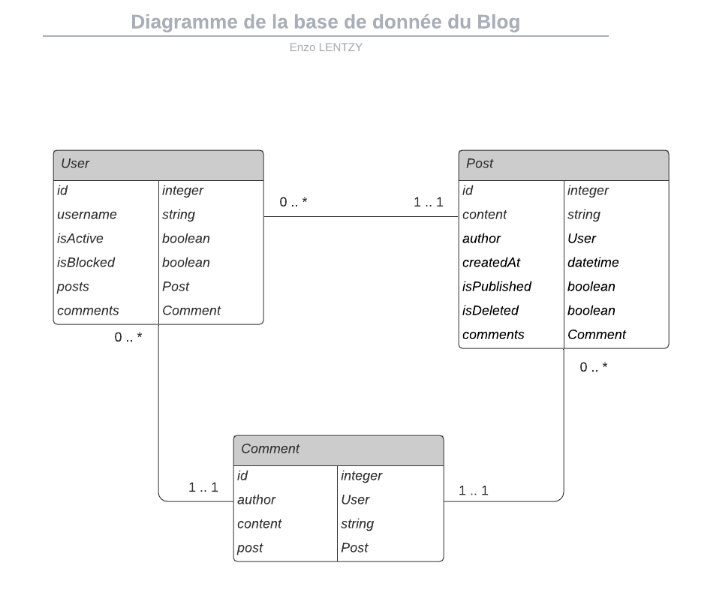

# TP3 : Blog sous Symfony

###### Vous retrouverez dans ce documents des réponses aux questions posées dans le sujet du TP3 à l'adresse: https://course.larget.fr/dim/php/tp/tp3/01-getting-started-with-symfony/

> ## Quelles sont les fonctionnalités principales du Symfony CLI ?

Le CLI permet de :

* Créer de nouveau projet (traditionnels ou des microservices, application console, API) :

  ```
   symfony new --full symfony_tp
  ```

* Utiliser les composants Symfony :

  ```
   symfony new symfony_tp
  ```

* Utiliser une demo de Symfony :

  ```
  symfony new my_project_name --demo
  ```

* Vérifier les fails de sécurités : 

  ```
  symfony check:security
  ```

* Créer des entitées facilement : 

  ```
  symfony console make:entity
  ```

* Et pleins d'autres commandes disponible en tapant : 

  ```
  symfony console
  ```

  

  # Doctrine 

  

  > ## Quelles relations existent entre les entités (Many To One/Many To Many/...) ? Faire un schéma de la base de données.



* ManyToOne : User peut avoir plusieurs posts tandis qu'un post peut avoir un seul User 

* ManyToMany : User peut avoir plusieurs posts et un post peut avoir plusieurs User 

* OneToMany : User peut avoir un post tandis que qu'un post peut avoir plusieurs User

* OneToOne : User peut avoir un post et un post peut avoir un User

  > Ceci est bien entendu un exemple non représentatif du TP, dans notre cas nous avons uniquement des ManyToOne


> ## Expliquer ce qu'est le fichier .env

Le fichier .env est un fichier d'environnement du projet. Il contient les informations de connexion aux base de données, mais également des informations sur l'environnement technique de Symfony (soit en dev soit en prod).

> ## Expliquer pourquoi il faut changer le connecteur à la base de données

Nous devons changer de base de données puisque nous utilisons une base SQLite tandis que le projet est défini sur une base PostgreSQL à sa création.

> ## Expliquer l'intérêt des migrations d'une base de données

Les migrations permettent de créer facilement et rapidement une base de données selon les relations entrées dans le projet. Elles nous permettent de versionner nos base de données et de s'assurer que nos données sont sauvegarder. Ainsi, lorsque nous changeons le format d'une donnée, cela nous permet de ne pas tout casser !


# Administrations

> ## Faire une recherche sur les différentes solutions disponibles pour l'administration dans Symfony

Au cours des recherches j'ai pu trouver deux bundles différents : 

* SonataAdmin
* EasyAdmin

Nous allons utiliser EasyAdmin dans ce projet

> ## Travail préparatoire : Qu'est-ce que EasyAdmin ?

EasyAdmin est un générateur d'admin pour Symfony, il permet de générer un backend rapidement en évitant d'avoir à répéter les lignes de codes. Il existe des commandes pour créer les structures des classes rapidement, toujours dans l'optique d'être efficace.

> ## Pourquoi doit-on implémenter des méthodes to string dans nos entités?

Il est nécessaire d'implémenter des méthodes toString car l'affichage d'un objet est impossible, ainsi, avec la méthode toString nous affichons un string, ce qui est possible. De plus, cela permet d'éviter les injections de codes ! 

# Controllers

> ## Qu'est-ce que le ParamConverter ? À quoi sert le Doctrine Param Converter ?

Le ParamConverter permet est un outil de conversion qui permet de récupérer l'entitée courante. Il peut également gérer les erreurs 404 à notre place !

# Forms 

> ## Qu'est-ce qu'un formulaire Symfony ?

Le formulaire symfony est créable à l'aide d'un outil intégré, et il permet de créer des formulaires très simplement.

> ## Quels avantages offrent l'usage d'un formulaire ?

Les formulaires Symfony générent automatiquement des champs côté front-end qu'il est possible de customiser simplement avec des bibliothèques et du css. De plus il crée des champs dynamiques côté back-end qui gèrent les erreurs (par exemple les mails sans @ dedans vont générer une erreur). Enfin, ils peuvent également hash les mots de passe afin de sécuriser l'application.

> ## Quelles sont les différentes personnalisations de formulaire qui peuvent être faites dans Symfony ?

* Customisation des validations
* Customisation du rendu HTML
* Customisation "FormType"

# Sécurité

> ## Définir les termes suivants : Encoder, Provider, Firewall, Access Control, Role, Voter

Encoder : C'est le nom de l'algorithme qui encode les mots de passe

Firewall : C'est ce qui permet de rendre accessible ou non les urls en fonction des rôles

Access Control : C'est le fait d'autoriser / refuser des accès ou des affichages d'informations selon les rôles des utilisateurs. 

Rôles : Ce sont les rôles attriubé à chaque utilisateur. Le rôle Anonyme est automatiquement attribué. Ils permettent de connaître les droits d'accès par utilisateurs.

Voter : Les voters permettent de centraliser les permissions et de les rendres facilement réutilisable.

> ## Définir les termes suivants : Argon2i, Bcrypt, Plaintext, BasicHTTP

Argon2i : C'est un algorithme de hash

Bcrypt : C'est également un algorithme de hash

Plaintext : C'est lorsque le texte est en clair, qu'il n'est pas encrypté et qu'il n'est donc pas sécuriser.

BasicHTTP : C'est lorsque l'authentification se réalise par le biais d'une popup du navigateur.

> ## Expliquer le principe de hachage.

Le hachage permet d'encoder les mots de passe afin de ne pas pouvoir le lire afin d'améliorer la sécurité.